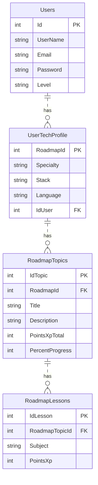

```mermaid
erDiagram
    Users ||..o{ UserTechProfile : has
    UserTechProfile ||..o{ RoadmapTopics : has
    RoadmapTopics ||..o{ RoadmapLessons : has

    Users {
        int Id PK
        string UserName
        string Email
        string Password
        string Level
    }
    UserTechProfile {
        int RoadmapId PK
        string Specialty
        string Stack
        string Language
        int IdUser FK
    }
    RoadmapTopics {
        int IdTopic PK
        int RoadmapId FK
        string Title
        string Description
        int PointsXpTotal
        int PercentProgress
    }
    RoadmapLessons {
        int IdLesson PK
        int RoadmapTopicId FK
        string Subject
        int PointsXp
    }
```